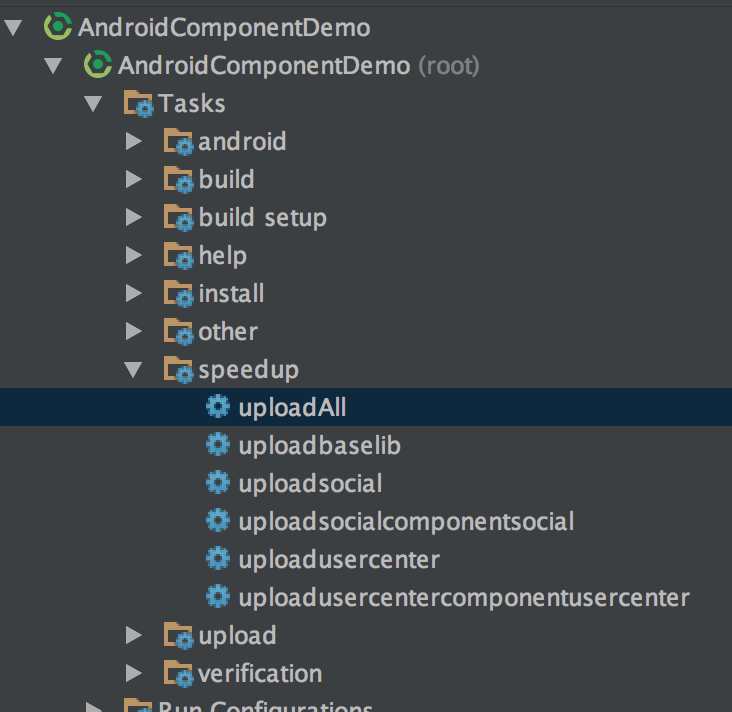
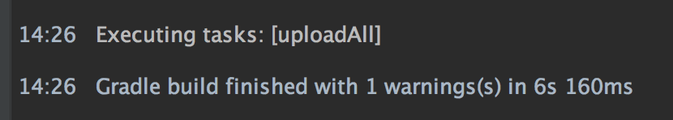
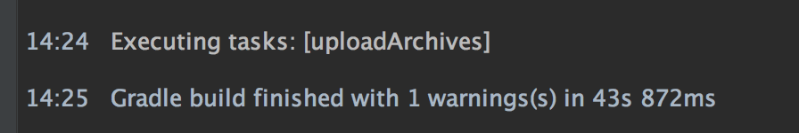

# Speedup

Speedup是一款针对于多组件构建加速的插件。特别是针对组件化开发，作用尤为明显。

### 什么人需要Speedup

随着项目不停迭代升级，项目越来越大，特别是最近两年开始流行了组件化之后。可能拆分的组件越来越多。
越来越细。导致项目下开启了一堆的module.每次运行的时候都会因此耗费大量的时间。

Speedup即是专用于解决此类由于堆积了一堆module之后的编译卡顿问题

### 原理

1. 将library打包发布到指定的本地maven仓库中
2. 启动运行任务时，自动查找本地build.gradle中配置的compile project依赖。替换为本地maven仓库中的aar地址

### 配置

在项目根目录下添加依赖并添加应用插件

latest = [](https://jitpack.io/#yjfnypeu/Speedup)

```groovy
buildscript {
    repositories {
        // 添加jitpack仓库地址
        maven { url "https://jitpack.io" }
    }
    dependencies {
        // 添加插件依赖
        classpath "com.github.yjfnypeu:Speedup:$latest"
    }
}
// 应用插件
apply plugin: 'speedup'
```

插件将配置属性放入local.properties文件中进行配置。更方便个人单独使用

- local.properties

```
speedup.enable=true
localRepo=localUrl
excludeModules=modulepath1,modulepath2
```

- speedup.enable
    
    此属性用于指定是否激活加速插件。默认为false。主要用于针对比如使用Jenkins打包发布时，不使用加速插件。

- localRepo

	此属性提供用于定制所使用的本地仓库地址。若不配置则默认使用项目根目录下的_repo目录作为本地仓库地址。 **(请注意将此目录加入版本控制忽略表中。避免提交)**

- excludeModules
    
    此属性的值为module的path值。即在settings.gradle中使用include所指定的路径地址：
    如 excludeModules=:app,:lib
    
    此属性用于指定不需要被加速的组件模块, 比如说组件化中的各自的业务线组件。
    这类组件因为是各自开发业务线的主module。需要随时变更改动。所以将其排除
    
    application module被默认排除的。不需要再进行单独配置
    
    此属性的作用：
    - 当打包发布时：此处所指定的模块将会不进行打包发布。
    - 当执行启动任务时：
        1. 对此组件依赖方式为compile project的，不进行替换
        2. 对别的替换的组件。子依赖含有此组件的依赖时。从aar子依赖中移除并替换为project依赖。
    
### 用法

主要用法是将module进行打包发布到本地maven库中去，发布方式分为两种：

- 使用全量打包发布：

使用提供的uploadAll任务进行全量打包发布。这种发布方式一般在切换分支后进行使用。

```
./gradlew uploadAll
```

- 对于部分module打包发布

不同的library含有各自单独的upload方法，如模块名为:loginLib：

```
./gradlew uploadloginLib
```

或者可使用AS提供的gradle任务视图窗口直接进行使用：



然后直接通过进行启动即可。和平时开发时一样

#### 问答

- 为什么不直接使用uploadArchives任务进行直接打包发布？

这是为了能更方便更快速的进行打包编译。

因为如果直接使用AS的gradle任务窗口中的uploadArchives任务时：会触发使用root project的uploadArchives命令。
导致其实一些不需要在此时被编译的模块也都会进行编译打包，严重影响了发布速度。

而使用命令行的方式执行单个的module的uploadArchives任务可以避免以上情况，但是略显复杂，容易使用不顺

以下为使用demo进行测试时，完全clean后分别使用uploadAll以及uploadArchives时的运行时间对比：





- 我直接搭个远程仓库就可以打包发布了。为什么要来用这种打包发布到本地的策略用法？

远程仓库和本地仓库各有特点。本地仓库的最主要特点是version不唯一，即可不用每次都去修改版本号再发布，完全可以同一个版本覆盖发布。

个人给的建议是：对于一些基本已经比较稳定了的library，可选择发布到远程仓库中去。而对于组件化这种形式的。大部分的library其实是一直在变一直在修改的。可选择发布到本地仓库中。避免过于频繁的修改版本号打包发布。

#### 示例

***可参考[一个简单的组件化demo](https://github.com/yjfnypeu/AndroidComponent)***

### 联系作者
email: 470368500@qq.com

<a target="_blank" href="http://shang.qq.com/wpa/qunwpa?idkey=99e758d20823a18049a06131b6d1b2722878720a437b4690e238bce43aceb5e1"></a>

或者手动加入QQ群: 108895031
    
## License
[apache 2.0](./LICENCE)